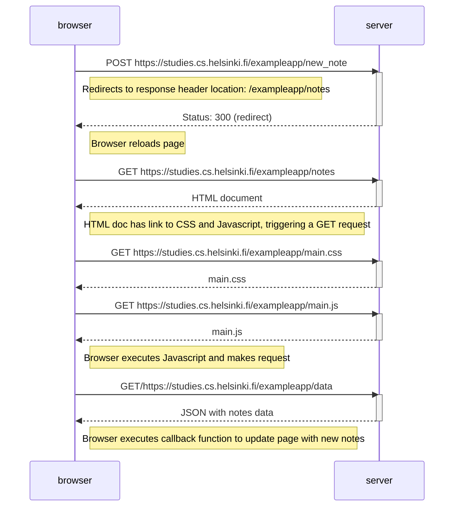

```mermaid
sequenceDiagram
participant B as browser
participant S as server

B->>S: POST https://studies.cs.helsinki.fi/exampleapp/new_note
activate S
note right of B: Redirects to response header location: /exampleapp/notes
S-->>B: Status: 300 (redirect)
deactivate S
note right of B: Browser reloads page 
B->>S: GET https://studies.cs.helsinki.fi/exampleapp/notes
activate S
S-->>B: HTML document
deactivate S
note left of S: HTML doc has link to CSS and Javascript, triggering a GET request
B->>S: GET https://studies.cs.helsinki.fi/exampleapp/main.css
activate S
S-->>B: main.css
deactivate S
B->>S: GET https://studies.cs.helsinki.fi/exampleapp/main.js
activate S
S-->>B: main.js
deactivate S
note right of B: Browser executes Javascript and makes request
B->>S: GET/https://studies.cs.helsinki.fi/exampleapp/data
activate S
S-->>B: JSON with notes data
deactivate S
note right of B: Browser executes callback function to update page with new notes
```