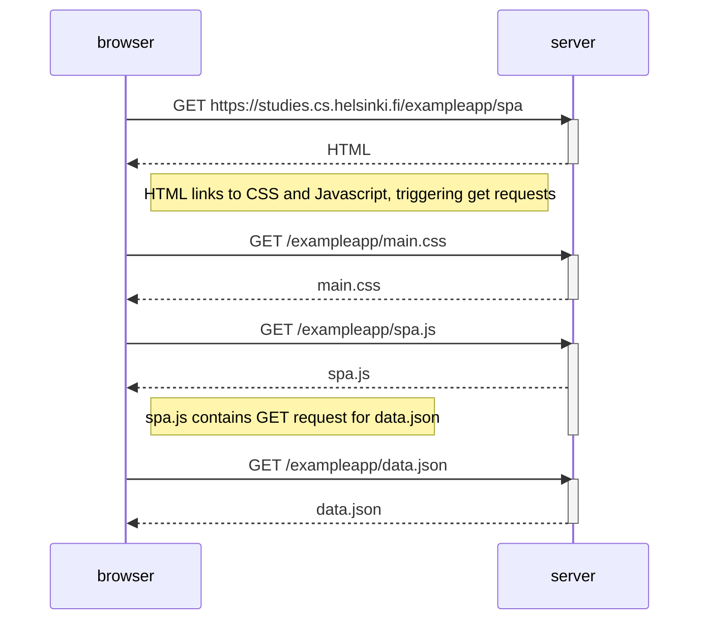

```mermaid
sequenceDiagram
participant B as browser
participant S as server

B->>S: GET https://studies.cs.helsinki.fi/exampleapp/spa
activate S
S-->>B: HTML
deactivate S
note left of S: HTML links to CSS and Javascript, triggering get requests
B->>S: GET /exampleapp/main.css
activate S
S-->>B: main.css
deactivate S
B->>S: GET /exampleapp/spa.js
activate S
S-->>B: spa.js
note right of B: spa.js contains GET request for data.json
deactivate S
B->>S: GET /exampleapp/data.json
activate S
S-->>B: data.json
deactivate S
```