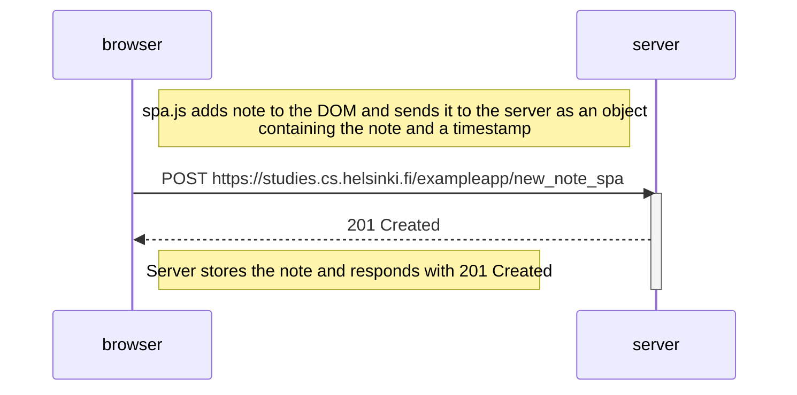

```mermaid
sequenceDiagram
participant B as browser
participant S as server

note right of B: spa.js adds note to the DOM and sends it to the server as an object<br>containing the note and a timestamp
B->>S: POST https://studies.cs.helsinki.fi/exampleapp/new_note_spa
activate S
S-->>B: 201 Created
note right of B: Server stores the note and responds with 201 Created
deactivate S

```